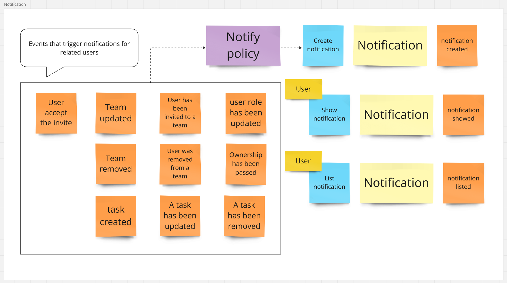
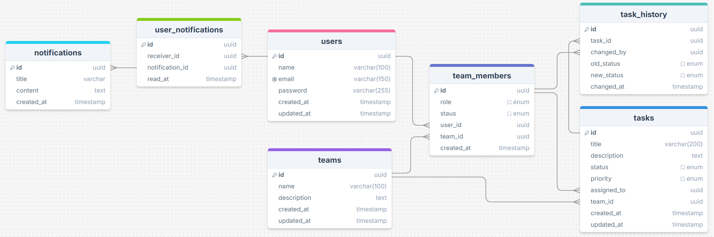

# Team Task Manager API

API for a Task Management system, where users can create accounts, log in, and manage tasks. Tasks can be assigned to team members, categorized by status and priority, and tracked.

This repository is the resolution of the [RocketSeat](https://www.rocketseat.com.br/) FullStack training track challenge.

## Execution flow, features and entities

## Database

